## Giriş

### Ruby Tarihi
Öncelikle Ruby progrmalama dilinin tarihçesinden bahsetmek istreim.
Ruby, Yukihiro "Matz" Matsumoto tarafından 1990'ların ortalarında Japonya'da yaratıldı ve geliştirildi. Ruby'nin ortaya çıkış amacı, programcı dostu bir dil oluşturmak ve hem fonksiyonel hem de nesne yönelimli programlama paradigmalarını destekleyen esnek bir dil yaratmaktı.
1. 1993: Ruby'nin geliştirilmesine başlandı. Matz, mevcut dillerin (özellikle Perl, Python, Smalltalk, Eiffel ve Ada) eksikliklerini giderecek bir dil oluşturmayı hedefledi. Özellikle Perl'ün güçlü metin işleme özelliklerinden, Smalltalk'un nesne yönelimli tasarımından ve Lisp'in fonksiyonel programlama yeteneklerinden ilham aldı.
2. 1995: Ruby'nin ilk kamuya açık sürümü yayımlandı. Bu sürümde Ruby, tamamen nesne yönelimli bir dil olarak tanıtıldı. Ruby'de her şey, sınıflar ve nesnelerle temsil edilir; hatta temel veri tipleri bile nesnedir. Bu, Ruby'nin esnek ve tutarlı bir dil olmasını sağladı.
3. 2000: Ruby'nin İngilizce dokümantasyonları ve web siteleri yaygınlaşmaya başladı. Bu durum, dilin Japonya dışındaki geliştiriciler tarafından da kullanılmasına yol açtı. Özellikle Batı'da dilin popülaritesi artmaya başladı.
4. 2003: Ruby'nin 1.8 sürümü yayımlandı. Bu sürüm, birçok yeni özellik ve iyileştirme ile geldi ve Ruby'nin olgunlaşma sürecinde önemli bir adım oldu.
5. 2004: David Heinemeier Hansson, Ruby on Rails adlı web uygulama çatısını tanıttı. Ruby on Rails, Ruby dilinin popülaritesinin hızla artmasına neden oldu. Rails, geliştiricilere hızlı ve verimli bir şekilde web uygulamaları geliştirme imkanı sunan bir çatıydı. Bu, Ruby'nin geniş bir geliştirici kitlesi tarafından benimsenmesine büyük katkı sağladı.
6. 2007: Ruby'nin 1.9 sürümü yayımlandı. Bu sürümde dilin performansı ve birçok dil özelliği iyileştirildi. Ayrıca, Ruby 1.9, dilin modernleştirilmesi açısından önemli bir adımdı.
7. 2013: Ruby'nin 2.0 sürümü piyasaya sürüldü. Bu sürümle birlikte birçok yeni özellik ve performans iyileştirmesi getirildi. Ruby 2.x sürümleri, dilin modern yazılım geliştirme gereksinimlerine daha iyi cevap vermesini sağladı.
8. 2020: Ruby 3.0 sürümü tanıtıldı. Bu sürüm, Ruby'nin performansını büyük ölçüde artırmayı hedefleyen "3x3" projesinin bir parçası olarak geliştirildi ve Ruby'nin hızının üç katına çıkarılması hedeflendi. Bu sürümde ayrıca eşzamanlılık (concurrency) ve paralellik (parallelism) desteği gibi önemli özellikler eklendi.

### Ruby Nasıl Bir Dildir

Ruby, yorumlanan bir programlama dilidir. Bu, Ruby kodunun çalıştırılmadan önce derlenmediği anlamına gelir. Bunun yerine, Ruby kodu bir Ruby yorumlayıcısı tarafından satır satır işlenir ve çalıştırılır.

#### Yorumlanan Dillerin Özellikleri
1. Anında Çalıştırma: Yorumlanan diller, kodun derlenmesini beklemeden hemen çalıştırılmasını sağlar. Bu, geliştiricilerin kodlarını hızlı bir şekilde test etmelerini ve hata ayıklamalarını kolaylaştırır.
2. Platform Bağımsızlık: Ruby kodu, Ruby yorumlayıcısının çalıştığı her yerde çalışabilir. Farklı işletim sistemlerinde (Linux, Windows, macOS gibi) aynı kod, yorumlayıcı olduğu sürece çalıştırılabilir.
3. Dinamiklik: Ruby, dinamik bir dildir. Bu, değişkenlerin tiplerinin çalışma zamanında belirlenmesi ve kodun esnek bir şekilde işlenebilmesi anlamına gelir. Ruby'de her şey nesnedir, bu da dinamik programlama yapısını daha güçlü kılar.

##### Avantajlar
1. Geliştirme süresi daha kısa (arada zeki bir yorumlayıcı var, daha az lafla çok iş).
2. Çalışma zamanı denetlenebildiğinden "dinamik" işler çevrilebilir.
3. Çalışma zamanı denetlenebildiğinden basit güvenlik açıkları yaşanmaz.
4. Daha "taşınabilir" (portable); yazdığınız kodun ilgili platformda çalışması için yorumlayıcının oplatformda kurulu olması yeterli (fakat bk. lojistik).
##### Dezavantajlar
1. Daha yavaş
2. Daha fazla bellek tüketimi.
3. Çalışma zamanında yaşanan sürpriz hatalar (derlenebilseydi çalıştırmadan önceyakalanabilirdi).
4. Artan lojistik yük (yorumlayıcı kurulumu gerekiyor).

Yorumlanan dillere değinmişken derlenen dillerin özelliklerinden bahsetmek gerekirsede:

#### Derlenen Dillerin Özellikleri
1. Performans: Derlenen diller genellikle yorumlanan dillere göre daha hızlı çalışır. Derleme sırasında kod, makine diline çevrilir ve bu nedenle yürütme süresi boyunca ek bir yorumlama aşaması olmaz. Bu, yüksek performanslı uygulamalar için avantaj sağlar.
2. Hata Kontrolü: Derleyiciler, kodu çalıştırmadan önce birçok sözdizimi ve dilbilgisi hatasını tespit eder. Bu, hata ayıklama sürecini daha kolay hale getirir çünkü hatalar derleme sırasında belirlenir ve çalıştırma aşamasında ortaya çıkmaz.
3. Optimizasyon: Derleyiciler, kodun performansını artırmak için çeşitli optimizasyonlar yapabilir. Bu optimizasyonlar, kodun daha verimli çalışmasını sağlar ve performansı artırabilir.
4. Platform Bağımsızlığı: Derlenen kod genellikle belirli bir platforma veya işletim sistemine özgüdür. Farklı platformlar için farklı derleme yapılması gerekir. Ancak, bazı diller (örneğin Java) platform bağımsızlığı sağlamak için derleyici tarafından ara bir dil (bytecode gibi) oluşturur ve bu bytecode bir sanal makine tarafından çalıştırılır.
5. Bağımsız Yürütme: Derlenen bir program, çalışma zamanında bir yorumlayıcıya ihtiyaç duymaz. Yürütülebilir dosya doğrudan işletim sistemi tarafından çalıştırılabilir. Bu, dağıtım ve kurulum süreçlerinde kolaylık sağlar.
6. Bellek Yönetimi: Derlenen diller genellikle bellek yönetimini geliştiricinin sorumluluğuna bırakır. Bu, geliştiricilerin bellek kullanımını doğrudan kontrol etmelerine olanak tanır, ancak bellek sızıntıları ve diğer bellek yönetimi sorunları ile ilgili riskleri artırabilir.

##### Avantajlar
1. Çalışma zamanında yorumlama olmadığından (veya minimize edildiğinden) çok daha hızlı.
2. Bellek kullanımı daha az.
3. Sorunlar program çalışmadan önce (derleme aşamasında) yakalanabilir.
4. Lojistiği daha kolay; hedef platform için derlenmiş programın kurulumu yeterli, ayrıca biryorumlayıcı kurmanıza gerek yok.
##### Dezavantajlar
1. Yazılması daha maliyetli (derleyiciyi mutlu etmek zorundasınız, tip bildirimleri gibi dahaayrıntılı tarifler gerekiyor).
2. Çalışma zamanı üzerinde denetiminiz olmadığından "dinamik" işler çeviremezsiniz.
3. (C gibi en azından bir kısım dilde) Çalışma zamanında güvenlik açıkları.

## Kurulumlar
Ruby programlamadan önce kurmamız gereken araçlara göz atalım. Bunlar:
1. Entegre Geliştirme Ortamı(IDE) olarak açık kaynak VS Code'u kullanacağız.
2. Ruby

### IDE kurulumu
Öndelikle [VS Code](https://code.visualstudio.com/download) sayfasına giderek oradan işletim sistemimize uygun olan kurulum aracını indirmemiz gerekiyor.
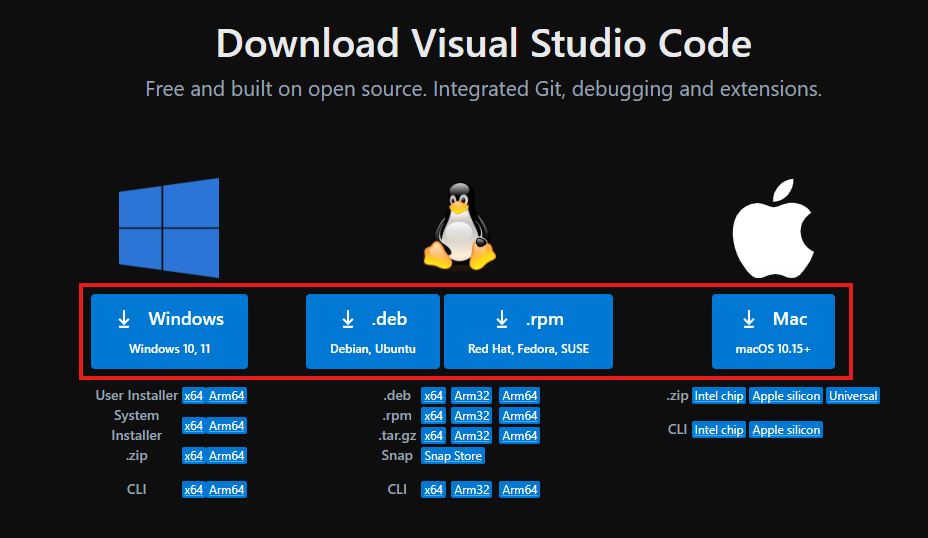

Bilgisayarımızın indirilenler klasörüne gidip kurlulum dosyamızı çalıştırıyoruz.

1. Aşama

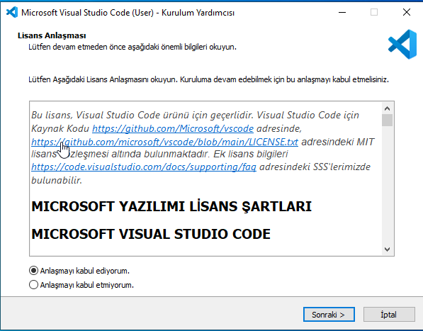

`Anlaşmayı kabul ediyorum` işaretleyip `sonraki` diyerek devam ediyoruz.

2. Aşama

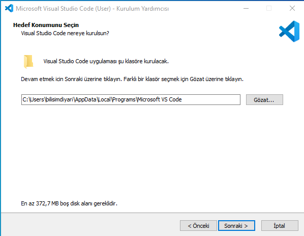

Burada isterseniz Visual Studio Code'u farklı bir dizine kurabilirsiniz. Kurmak istediğiniz dizini seçtikten sonra `sonraki` diyerek devam ediyoruz.

3. Aşama

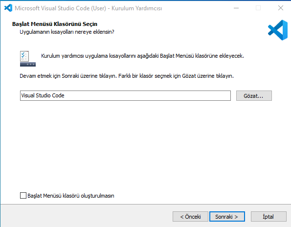

Burada hiç bir şey yapmadan `sonraki` diyerek devam ediyoruz.

4. Aşama

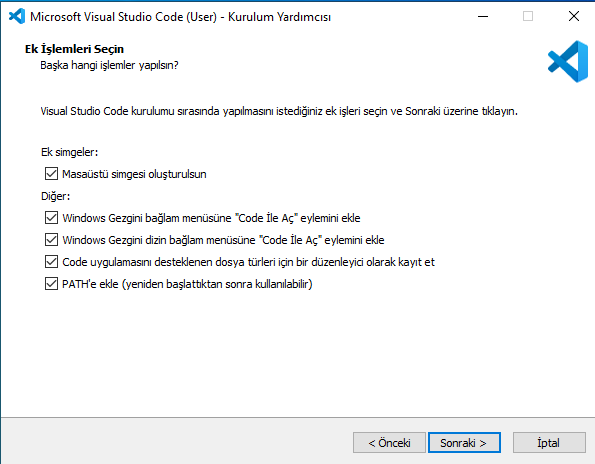

Bura önemli olan iki işlem var
   - [x] Windows Gezgini bağlam menüsüne "Code ile Aç" eylemini ekle.
   - [x] Windows Gezgnı dizin bağam menüsüne "Code ile Aç" eylerninı ekle.
Bunlar sizde işaretli gelmeyecek. Bunkları işaretleyerek devam edersek sonrasında bizlere kolaylık sağlayacaktır. `sonraki` diyerek devam ediyoruz.

5. Aşama

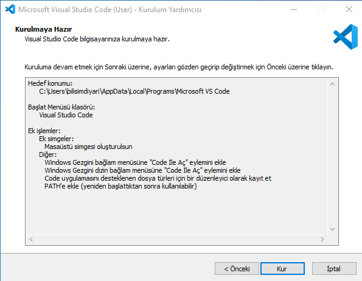

`Kur` diyerek devam ediyoruz.

6. Aşama

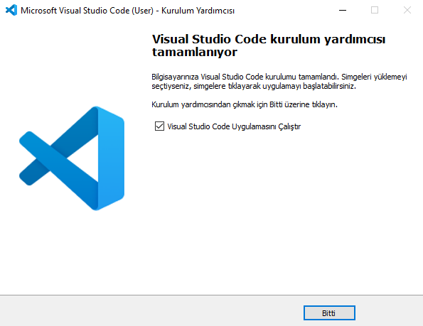

`Bitti` diyerek kurulum aşamalarımızı sonlandırıyoruz.

Bu aşamalardan sonra VS Code IDE'mizi başlatıyoruz.

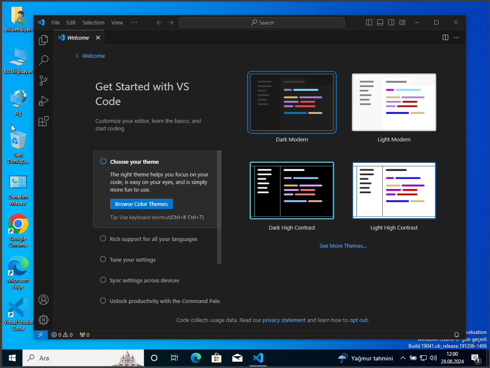
Burada biray yapıyı kurcalayabilirsiniz mesela tema seçebilirsinin `Get Started` ile temel özellekleri inceleyebilrsiniz. Ben bu aşamada sizlere bir kaç ayar göstereceğim.

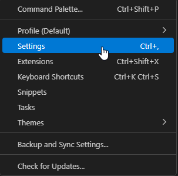

Buradan `Settings`'i açıyoruz.

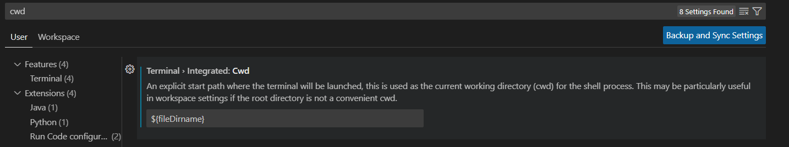

- CWD

Açılan pencerede arama yerine `cwd` yazıyoruz. **Terminal > Integrated: Cwd** başlığı alttında `${fileDirname}` yazıyoruz. Böylece terminalimizi kısa yol açma tuş kombinasyonu `Ctrl + Shift + "` kombinasyonunu açık bir dosyada uyguladığımızda o dosya hangi dizinde ise terminalimiz o dizinde açılacaktır.

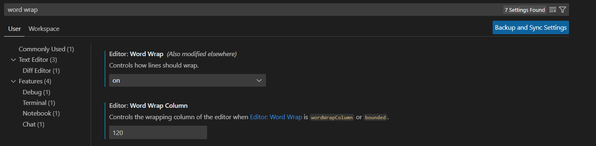

- Word Wrap

Açılan pencerede arama yerine `word wraop` yazıyoruz. **Editor: Word Wrap** başlığı alttında `on` seçimini yapıyoruz. Sonrasında **Editor: Word Wrap Colum** başlığı alttında `120` yazarak bu işlemi de tamamlamış oluyoruz. Böylece Editorümüz de yazdığımız kod satırları sürekli sağa doğru kaymayıp 120 sütün genişliğe gelirken bir aşağı satuıra kayacak ve bizim için sürekli sağa kaydırmadan kodlarımızı bir bütün olarak görmeye başlayacağız.

### Ruby Kurululumu
Öndelikle [Ruby](https://www.ruby-lang.org/tr/downloads/) sayfasına giderek oradan işletim sistemimize uygun olan kurulum aracını indirmemiz gereken sayfaları seçmemiz gerekmekte.
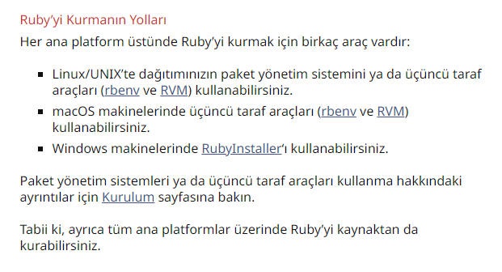
Ben anlatımımda Windows bir makine kullandığım için sizlere Windows üzerinden göstereceğim ama MacOs ve Linux cihazlar için bağlantıdaki adresten kurulum aşamalarını takip edebilirsiniz.
Burada biz `RubyIntaller` a basarak [Ruby indirme](https://rubyinstaller.org/) sayfasına gidiyoruz. Açılan sayfada `Dowload` a basarak devam ediyoruz.
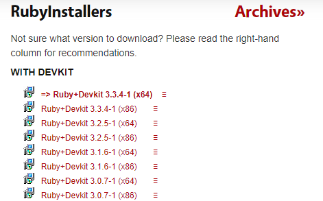
Sonrasında karşımıza çıkan sayfada işletim sistemimize göre (x64 veya x86 olmasına göre) en son sürümü cihazımıza indiriyoruz.

Sistemimizin indirilenler klasörü altından kuruluma başlayabiliriz.

1. Aşama

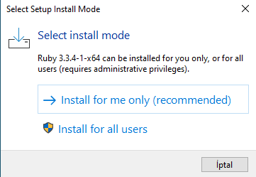

Burada istediğiniz seçenekle deavam edebilirsiniz. Ben tüm kullanıcılarımda çalışabilmesi adına `Install for all user` seçeneği ile devam edeceğim.

2. Aşama

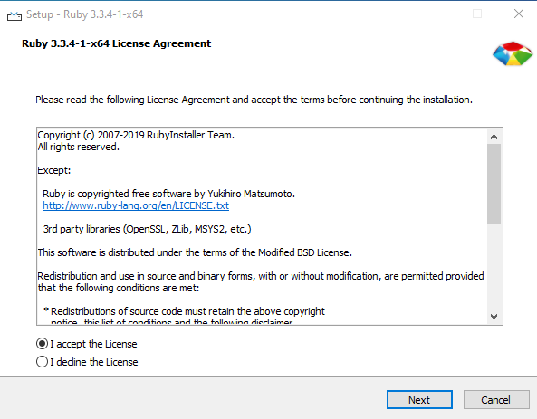

Burada istediğiniz seçenekle deavam edebilirsiniz. Ben tüm kullanıcılarımda çalışabilmesi adına `Install for all user` seçeneği ile devam edeceğim.

3. Aşama

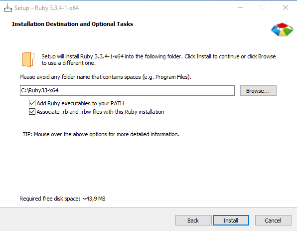

Burada isterseniz Ruby'nin kurulacağı dizini değiştirebilirsiniz. Ben `Instal` diyerek devam etmeyi tercih ediyorum.

4. Aşama

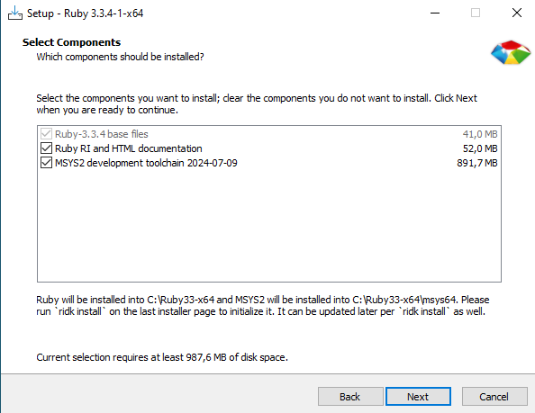

Burada `Next` diyerek devam ediyoruz.

5. Aşama

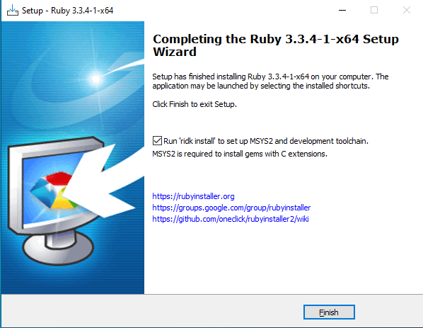

Kurulum tamamlandıktan sonra `Finish` diyerek konsol ekranın açılmasını bekjliyoruz.

6. Aşama

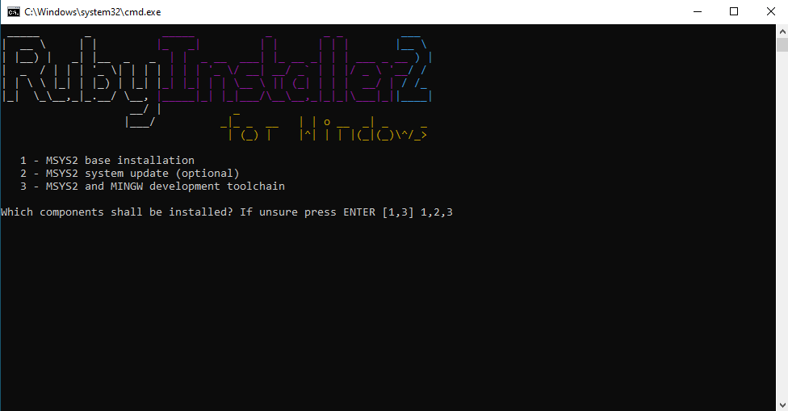

Açılan konsol ekranında gördüğünün gibi `1,2,3` yazarak `Enter`'a basarak devak ediyoruz ve gerekli dosyalarımız indirilmeye başlıyor.

7. Aşama

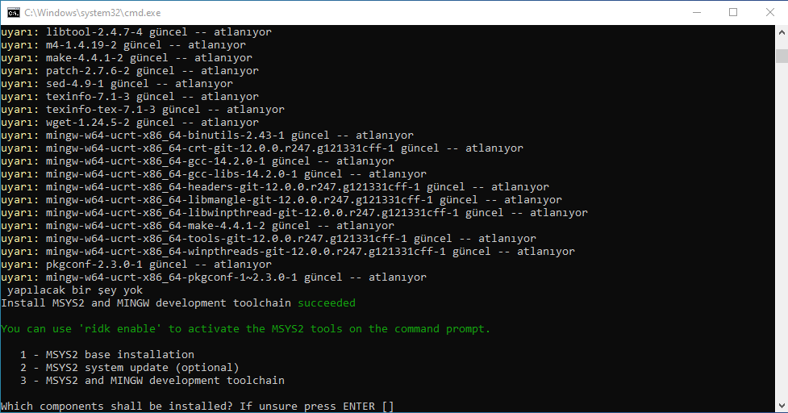

Kurulumlar tamamlandiktan sonra tekrar `Enter`'a basarak konsol ekranını kapatabiliriz.

Bu aşamamalardan sonra kurulumumuz tamamlanmış olmakla beraber Ruby Programlama dili artık cihazımızda kurulu durumdadır. Kontrokl etmek amacıyla terminalimizi açarak;

```shell
ruby --version
```
komutu ile doğrı şekilde kurulup kurulmadığını teyit edebiliriz.

## İlk Kod

### Ruby Hello World

İlk bir dil ile çalışacağımız zaman genel olarak ilk projemi `Hello, World!` yazısını terminalde yazdırmak olur.

Bu eğitimde öğreneceğimiz Ruby Programlama dili için yeni bir klasör oluşturalım. Çalışmalarımı bu dizinde yapmaya başlayalım.

VS Code ile içine girdiğimiz dizinde yeni bir dosya oluşturuyoruz. Ruby dosyaları `.rb` ile birmesi gerekir. `Hello, World!` prjemiz için ilk olarak `rubyHelloWorld.rb` adında yeni bir dosya oluşturuyoruz. İçerisine:

```ruby
puts "Hello, World!"
```

yazıyoruz ve terminalimizi açarak (dosya sayfada açikken`Ctrl + Shift + "` ile açabilirsiniz) terminale:

```shell
ruby rubyHelloWorld.rb
```

yazıp `Enter` basarak çalıştırabiliriz. Sonrasında terminalimizde aşağıdaki görseldeki gibi gözükecektir.

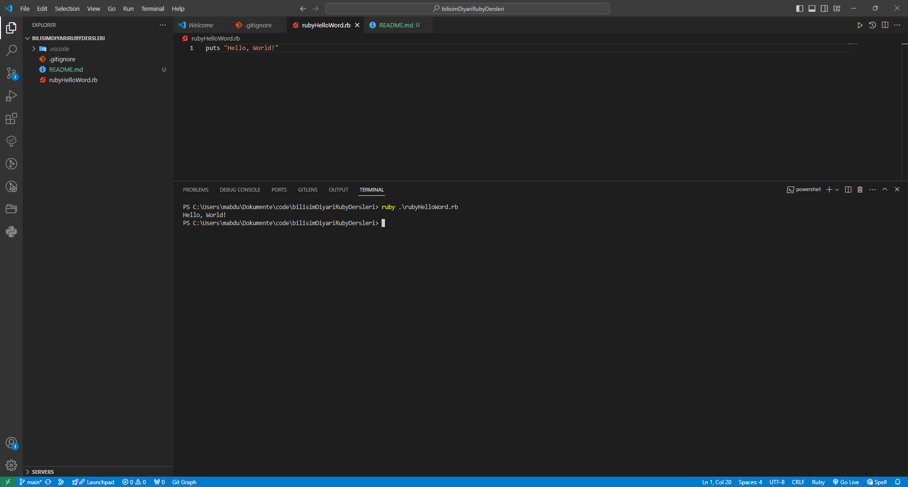

Burada bitiriyorum. Devamı için takipte kalın👋

---
## Kaynakçalar
- [Derlenen Diller](https://en.wikipedia.org/wiki/Compiler)
- [Yorumlanan Diller](https://en.wikipedia.org/wiki/Interpreter_(computing))
- [Ruby'nin Tarhi](https://tr.wikipedia.org/wiki/Ruby)

## Tavsiye Ettiğim Kaynaklar
Benimde öğrencilik yıllarımda aldığım kurslar ve takip ettiğim kaynaklar:
- [Sıfırdan İleri Seviye Ruby Programlama Dili - Erim Icel](https://www.udemy.com/course/sifirdan-ileri-seviye-ruby-programlama-dili/)
- [RUBY PROGRAMLAMA - Ender Kuş](https://www.google.com.tr/books/edition/RUBY_PROGRAMLAMA/os5TDwAAQBAJ?hl=tr&gbpv=0&kptab=overview/)

## İçeriğimizin Devamı
